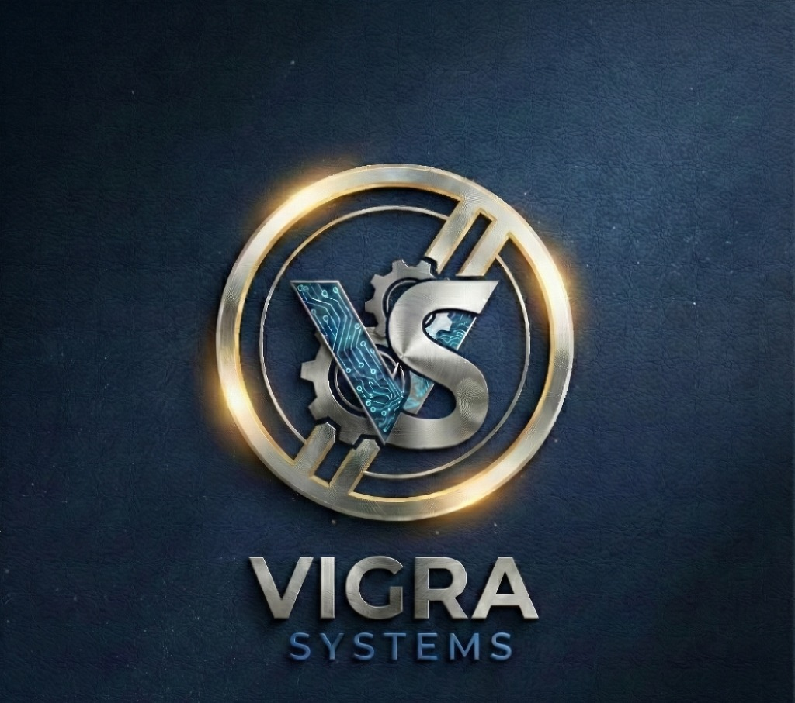

# Vigra-Systems

<div align="center">



**Student-Driven Innovation in Research & Development**

[](https://vigra-systems.com)
[](#license)

</div>

---

## 🚀 About Vigra-Systems

**Vigra-Systems** is a student-led startup at the forefront of research and development. We are driven by curiosity and powered by innovation, transforming complex engineering challenges into elegant solutions.

### Our Mission

To pioneer research and development by combining academic excellence with practical innovation, delivering high-quality engineering solutions that make a real-world impact.

### What We Do

| Service | Description |
|---------|-------------|
| 🔧 **Mechanical Test Simulation** | Stress characterization, structural validation with precision and repeatability |
| 🌐 **Real-World Work Simulation** | Process modeling and operational validation with precision and reliability |
| 📋 **Process Planning** | Workflow design and operational optimization with precision and efficiency |
| 📐 **3D Modelling** | Professional CAD modeling for engineering applications |
| 🔬 **Thermal Analysis** | Heat transfer and thermal performance evaluation |
| 📄 **Engineering Documentation** | Comprehensive technical documentation and reports |

---

## 🛠️ Technology Stack

This website is built with:

- **Frontend**: HTML5, CSS3, JavaScript (ES6+)
- **Backend**: Firebase (Firestore, Authentication, Storage)
- **Styling**: Custom CSS with modern design patterns
- **Hosting**: Vercel (with GitHub integration)
- **Analytics**: Google Analytics

---

## 📁 Project Structure

```
vigra-systems/
├── index.html              # Homepage
├── projects.html           # Projects showcase
├── project-detail.html     # Individual project view
├── team.html               # Team members
├── contact.html            # Contact form
├── quote.html              # Request a quote
├── populate-database.html  # Database seeding utility
│
├── admin/                  # Admin panel
│   ├── index.html          # Admin dashboard
│   ├── login.html          # Admin authentication
│   ├── projects.html       # Project management
│   ├── team.html           # Team management
│   ├── contacts.html       # Contact submissions
│   ├── quotes.html         # Quote requests
│   └── settings.html       # Site settings
│
├── assets/
│   └── images/             # Image assets
│
├── css/
│   ├── main.css            # Core styles
│   ├── components.css      # UI components
│   └── pages.css           # Page-specific styles
│
├── js/
│   ├── firebase-config.js  # Firebase initialization
│   ├── main.js             # Core JavaScript
│   ├── homepage.js         # Homepage functionality
│   ├── projects.js         # Projects page
│   ├── project-detail.js   # Project detail page
│   ├── team.js             # Team page
│   ├── contact.js          # Contact form
│   ├── quote.js            # Quote form
│   └── admin/              # Admin panel scripts
│
├── scripts/
│   └── build.js            # Build script for Vercel
│
├── .env.example            # Environment variables template
├── vercel.json             # Vercel configuration
└── package.json            # Project metadata
```

---

## 🚀 Deployment Guide

### Prerequisites

- A [GitHub](https://github.com) account
- A [Vercel](https://vercel.com) account
- A [Firebase](https://firebase.google.com) project

### Step 1: Prepare Your Repository

1. Create a new repository on GitHub
2. Upload all project files via drag-and-drop (or use Git)
3. **Important**: Do NOT upload the `.env` file (it contains sensitive credentials)

### Step 2: Connect to Vercel

1. Go to [vercel.com](https://vercel.com) and sign in
2. Click **"Add New Project"**
3. Import your GitHub repository
4. Vercel will auto-detect the project settings from `vercel.json`

### Step 3: Configure Environment Variables

In your Vercel project dashboard, go to **Settings → Environment Variables** and add:

| Variable Name | Description |
|---------------|-------------|
| `FIREBASE_API_KEY` | Your Firebase API key |
| `FIREBASE_AUTH_DOMAIN` | e.g., `your-project.firebaseapp.com` |
| `FIREBASE_PROJECT_ID` | Your Firebase project ID |
| `FIREBASE_STORAGE_BUCKET` | e.g., `your-project.firebasestorage.app` |
| `FIREBASE_MESSAGING_SENDER_ID` | Firebase messaging sender ID |
| `FIREBASE_APP_ID` | Your Firebase app ID |

> 💡 **Tip**: Find these values in your Firebase Console → Project Settings → General → Your apps

### Step 4: Deploy

1. Click **"Deploy"** in Vercel
2. Wait for the build to complete
3. Your site will be live at `your-project.vercel.app`

### Step 5: Custom Domain (Optional)

1. Go to **Settings → Domains** in Vercel
2. Add your custom domain (e.g., `vigra-systems.com`)
3. Follow the DNS configuration instructions

---

## 💻 Local Development

### Quick Start

1. Clone or download this repository
2. Copy `.env.example` to `.env` and fill in your Firebase credentials
3. Run the build script to generate the Firebase config:

```bash
node scripts/build.js
```

1. Open `index.html` in your browser, or use a local server:

```bash
npx serve .
```

### Using Live Server (VS Code)

1. Install the "Live Server" extension in VS Code
2. Right-click on `index.html` → "Open with Live Server"

---

## 🔐 Admin Access

The admin panel is available at `/admin/login.html`. Access methods:

1. **Direct URL**: Navigate to `yoursite.com/admin/login.html`
2. **Triple-click Logo**: Triple-click the logo in the navbar for quick access
3. **Footer Icon**: Click the team portal icon in the footer

---

## 🔧 Firebase Setup

### Required Services

Enable these services in your Firebase Console:

1. **Firestore Database** - For storing content
2. **Authentication** - For admin login
3. **Storage** - For file uploads

### Security Rules

Make sure to configure appropriate security rules for your Firestore database and Storage.

---

## 📞 Contact

- **Email**: [vigrasystems@gmail.com](mailto:vigrasystems@gmail.com)
- **Phone**: [+91 8555917305](tel:+918555917305)
- **Website**: [vigra-systems.com](https://vigra-systems.com)

---

## 📄 License

Copyright © 2025 Vigra-Systems. All rights reserved.

This is proprietary software. Unauthorized copying, modification, distribution, or use of this software is strictly prohibited.

---

<div align="center">

**Built with ❤️ by Vigra-Systems Team**

*Transforming complexity into clarity through research and development.*

</div>
